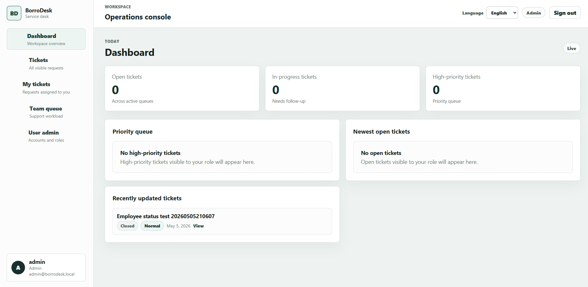
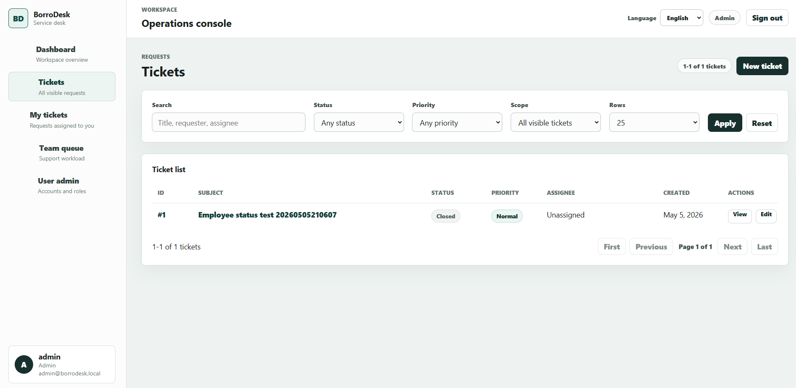
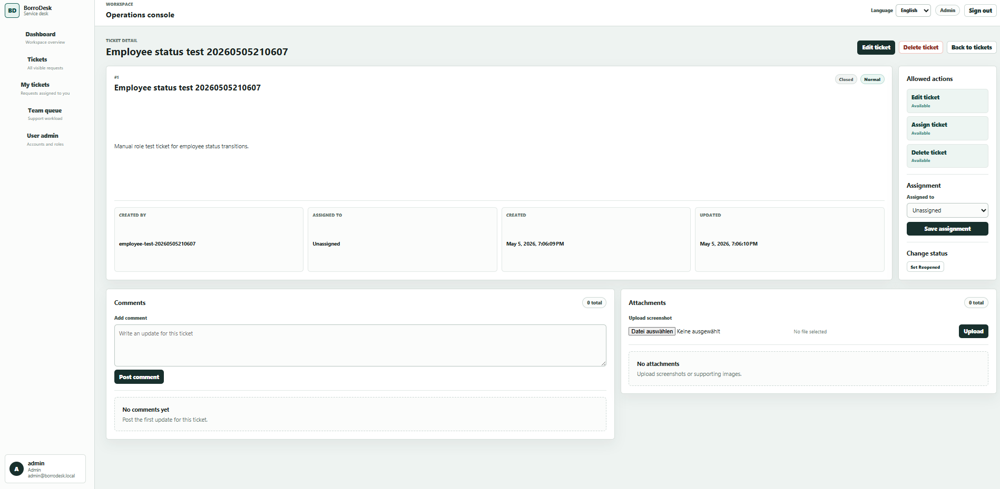
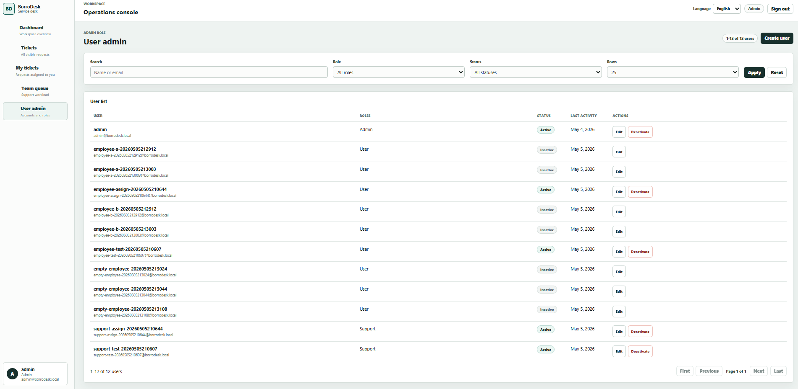

# BorroDesk

BorroDesk is an internal IT ticket management system built with **ASP.NET Core**, **Angular**, and **SQL Server**.

The application allows employees to report IT issues, while support agents and administrators can manage, assign, comment on, and resolve tickets.

This project was built as a portfolio project to demonstrate full-stack development with .NET and Angular.

---

## Features

- User authentication with JWT
- Role-based authorization
  - Employee
  - Support
  - Admin
- Create, edit, view, and delete tickets
- Ticket statuses:
  - Open
  - In Progress
  - Resolved
- Ticket priorities:
  - Low
  - Medium
  - High
- Comments per ticket
- Screenshot/file uploads for tickets
- Search, filtering, and pagination
- Ticket assignment for support/admin users
- Admin user management
- Dashboard with ticket overview
- Backend integration tests

---

## Tech Stack

### Backend

- .NET 10
- ASP.NET Core Web API
- Entity Framework Core 10.0.6
- ASP.NET Core Identity
- JWT Authentication
- SQL Server
- xUnit

### Frontend

- Angular 21
- TypeScript
- Angular Router
- Angular HTTP Client
- Reactive Forms

---

## Screenshots


### Dashboard



### Ticket List



### Ticket Details



### Admin User Management



---

## Project Structure

```text
BorroDesk/
├── backend/
│   ├── BorroDesk.Api/
│   └── BorroDesk.Api.Tests/
├── frontend/
│   └── borrodesk-ui/
├── docs/
│   └── screenshots/
└── README.md
```

---

## Getting Started

### Prerequisites

Make sure the following tools are installed:

- .NET 10 SDK
- Node.js
- npm
- SQL Server
- Angular CLI

---

## Backend Setup

Go to the backend project:

```bash
cd backend/BorroDesk.Api
```

Restore dependencies:

```bash
dotnet restore
```

Apply database migrations:

```bash
dotnet ef database update
```

Run the backend:

```bash
dotnet run
```

The API should be available at:

```text
https://localhost:7047
```

---

## Frontend Setup

Go to the frontend project:

```bash
cd frontend/borrodesk-ui
```

Install dependencies:

```bash
npm install
```

Run the Angular application:

```bash
npm start
```

The frontend should be available at:

```text
http://localhost:4200
```

---

## Demo Accounts

The application can be tested with seeded demo users:

```text
Admin
Email: admin@borrodesk.local
Password: Admin123!

Support
Email: support@borrodesk.local
Password: Support123!

Employee
Email: user@borrodesk.local
Password: User123!
```

---

## Running Tests

Backend tests can be executed with:

```bash
dotnet test
```

The test project includes integration tests for authentication, authorization, ticket permissions, comments, uploads, and admin functionality.

---

## Main User Roles

### Employee

Employees can:

- Create tickets
- View their own tickets
- Comment on their own tickets
- Upload screenshots
- Delete allowed tickets

### Support

Support users can:

- View tickets assigned to them
- Update ticket statuses
- Add comments
- Assign tickets where allowed
- Work on support queues

### Admin

Admins can:

- View and manage all tickets
- Manage users
- Assign roles
- Activate or deactivate users
- Reset user passwords

---

## API Overview

Main backend areas:

```text
/api/auth
/api/tickets
/api/tickets/{id}/comments
/api/tickets/{id}/attachments
/api/admin/users
```

---

## Security Notes

- Authentication is handled with JWT.
- Authorization is role-based.

---

## Development Notes

This project focuses on realistic business application features.

Implemented concepts include:

- Clean separation between controllers, services, DTOs, and entities
- Entity Framework Core migrations
- Role-based business rules
- Server-side validation
- File upload validation
- Integration testing
- Angular routing and guards
- API communication through Angular services

---

## License

This project is licensed under the MIT License.

---
